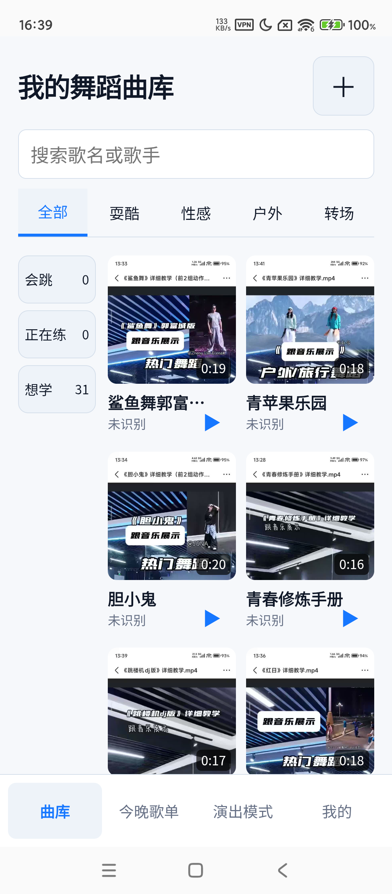

# Personal Dance Library

English | [简体中文](README.md)

A **personal-use** dance library: pull the music you actually dance to out of short videos and turn it into a collection you can filter, play offline, practice with, and perform from.

> The intended flow: collect songs at home (on a Mac), then take the phone out — **cold-start and play even with no network**, instead of scrambling through short-video apps on site.



## What it does

- **Cut the dancing audio out of a video**: import a local video, auto-extract a clip, fine-tune start/end points, and keep the original video for review.
- **Bulk classification**: use “Batch management” on the home screen to select multiple dances or all filtered results, then update progress or add/remove/replace scene tags together. Saving requires the local API.
- **Filter by progress and scene**: 3 learning states (Want to learn / Practicing / Can dance) × 4 scene tags (Cool / Sexy / Outdoor / Transition) to quickly pick what to practice today.
- **One-tap import from a share link**: share a short-video link into the app to create an entry; if the platform can't provide the media, the flow doesn't break — the link is kept so you can supply a local video later.
- **Works offline**: cached dances can still be filtered and played with no network (offline performance).
- **Tonight playlist + Performance mode**: line up what you'll dance and use large play / pause / previous / next controls.
- **One-tap play from the home grid**: play straight from a library card, with a floating bottom bar showing title, progress, and pause.
- **Theme-aware covers**: covers are matching gradients with a ♪ watermark and the dance name — light blue in light theme, deep blue in dark theme — switching automatically with the theme.

## Who it's for

A **single-user** personal tool: collect your own songs, practice on your own, perform on your own. No accounts, no multi-user collaboration.

## Quick start

Use the verified **Node.js 24** runtime (the package declares a minimum of ≥ 22).

```bash
# 1. Install dependencies
npm install

# 2. Start the local API (defaults to 127.0.0.1:8791)
npm run server:dev

# 3. In another terminal, start the frontend (127.0.0.1:5173, /api proxied to 8791)
npm run dev
```

Then open http://127.0.0.1:5173 . Health check: http://127.0.0.1:8791/api/health .

Common commands:

```bash
npm run build     # type-check + frontend build
npm run test      # unit / component tests
npm run lint      # lint
```

## Build as an Android app

Built with Capacitor 8. The delivery form bundles the frontend into the app (the WebView loads local assets and reaches the local API over a private LAN).

```bash
npm run build
npx cap sync android
# Requires Java 21
JAVA_HOME=<your JDK21 path> ANDROID_HOME=<your Android SDK path> \
  ./android/gradlew -p android :app:assembleDebug
```

Output: `android/app/build/outputs/apk/debug/app-debug.apk`.

## Run the backend with Docker

```bash
docker compose up --build
```

- The API listens on `8791` inside the container; the host maps it to `8792` by default (change with `DANCE_PORT`).
- Data (SQLite database and media files) persists in `./var/docker`.
- Ships with a health check (`/api/health`).

## Configuration

Configured via environment variables (see `.env.example`). Server secrets are **never committed to Git and never shipped to the client**.

| Variable | Default | Purpose |
| --- | --- | --- |
| `HOST` | `127.0.0.1` | API bind address |
| `PORT` | `8791` | API port |
| `SQLITE_DB_PATH` | `var/personal-dance-library.db` | SQLite database path |
| `MEDIA_ROOT` | `var/media` | Directory for audio / covers / source videos |
| `MUSIC_RECOGNITION_PROVIDER` | `disabled` | Recognition provider (off by default) |
| `MUSIC_RECOGNITION_API_KEY` | empty | Recognition service key (if enabled) |

## Known limitations

- **Recognition is off by default**: without a real key it runs in disabled/mock mode and never fabricates results; title/artist can be entered manually.
- **Depends on the local API**: the phone must reach the machine running the API (same private LAN). Outside that network it relies on cached content.
- **Verification still open**: physical offline cold start (T064) and Docker isolated build/run (T089) passed; final user acceptance (T096) remains open; the first release still needs the owner's sign-off.

## Tech stack

React 19 · TypeScript · Vite 7 ｜ Node.js local API (`node:sqlite`) ｜ Capacitor 8 (Android) ｜ HTML5 `<audio>`.

## More docs

- Spec and plan: [specs/001-personal-dance-library/](specs/001-personal-dance-library/)
- Verification evidence (device / offline / audio / Docker): [docs/verification/](docs/verification/)
- Current handoff snapshot: [docs/handoff/HANDOFF.md](docs/handoff/HANDOFF.md)
- Infrastructure guides (Docker / SQLite / Android): [docs/sop/](docs/sop/)

## License

No open-source license is declared; this is a personal-use project.
