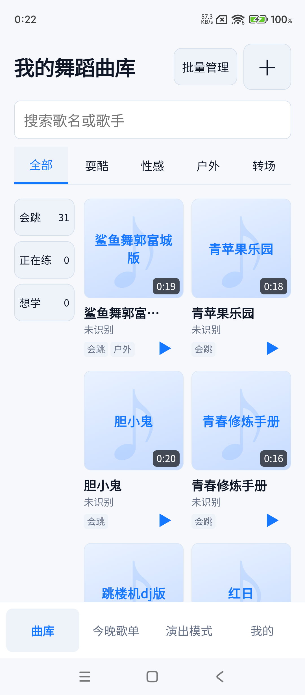

# 个人才艺曲库（舞蹈 / 吉他 / 唱歌）

[English](README.en.md) | 简体中文

一个**给自己用**的个人才艺曲库：保存自己的音乐、谱和歌词，整理成能筛选、能离线练习与演出的曲库。

> 目标场景：在家里（Mac）把歌收好，带手机出门——**现场没网也能冷启动、直接播放**，不用再临时翻抖音。



## 它能做什么

- **吉他和唱歌曲库（V2 最小版本）**：顶部切换才艺，先录入歌名、调性和文本谱/歌词，再导入自己的音频或视频。吉他记录 Capo，唱歌区分伴奏/示范；支持搜索、学习状态、编辑和删除确认。
- **练习播放器**：吉他/唱歌详情可播放、暂停、单曲循环和变速；调性与 Capo 只记录，不改变音高。
- **下载全部音乐到手机**：在“我的”下载三类曲目的音频和封面，显示进度、失败名单，停止后保留已完成文件，重试只补缺失文件；纯文本谱和歌词也会离线保存。

- **从视频里裁出跳舞用的音乐**：导入本地视频，自动截取片段，还能手动微调起止点，并保留原始视频随时回看。
- **批量分类**：首页进入“批量管理”，勾选多首或全选当前结果，一起改学习状态，或添加、移除、替换场景标签。手机断网也可保存，联网后同步。
- **按学习状态和场景筛选**：3 个学习状态（想学 / 正在练 / 会跳）× 4 个场景标签（耍酷 / 性感 / 户外 / 转场），快速找到"今天要练哪支"。
- **抖音分享链接一键收录**：从抖音分享到本应用即可建条目；若平台拿不到媒体，流程不会中断——链接会保留，之后再补本地视频。
- **断网也能用**：已缓存的舞蹈在没有网络时依然可以筛选、播放（离线演出）。
- **今晚节目单 + 演出模式**：混排舞蹈和唱歌，拖动或上下移动排序，查看歌词/谱，用大按钮播放、暂停与切项；切项不自动发声。
- **首页一键播放**：曲库卡片上直接播放，底部有悬浮播放条显示曲名、进度与暂停键。
- **主题自适应封面**：封面是同色系渐变卡片 + ♪ 水印 + 舞名文字，浅色主题浅蓝渐变、深色主题深蓝渐变，跟随主题自动切换。
- **回收站**：查询、批量恢复与永久删除记录，原始素材保留。
- **原创试用示例**：“我的→试用示例”可导入、补齐与确认清除独立登记的示例；只下载示例文件。交付保留示例供试用。
- **图片/PDF 与歌词**：唱歌支持多谱排序/解绑、图片缩放、PDF 翻页/书签，以及触摸即暂停的歌词自动滚动；PDF.js 资源随 APK 打包。
- **本地点歌**：配对后选择公开曲目生成 24 小时二维码，同网来宾只能看标题与类别，主人审批才加入节目单。

## 适合谁

面向**单个使用者**的个人工具：自己收歌、自己练舞、自己上台演出。不做账号体系，也不面向多人协作。

## 快速开始

建议使用已验证的 **Node.js 24**（包声明最低版本 ≥ 22）。

```bash
# 1. 安装依赖
npm install

# 2. 启动本地 API（默认 127.0.0.1:8791）
npm run server:dev

# 3. 另开一个终端，启动前端（默认 127.0.0.1:5173，/api 自动代理到 8791）
npm run dev
```

打开 http://127.0.0.1:5173 即可。健康检查：http://127.0.0.1:8791/api/health 。

常用命令：

```bash
npm run build     # 类型检查 + 前端构建
npm run test      # 单元 / 组件测试
npm run lint      # 代码检查
```

## 打包成 Android App

使用 Capacitor 8，交付态为**打包好的前端整机运行**（WebView 加载本地资源，通过私有局域网访问本机 API）。

```bash
npm run build
npx cap sync android
# 需要 Java 21
JAVA_HOME=<你的 JDK21 路径> ANDROID_HOME=<你的 Android SDK 路径> \
  ./android/gradlew -p android :app:assembleDebug
```

产物：`android/app/build/outputs/apk/debug/app-debug.apk`。

## 用 Docker 运行后端

```bash
docker compose up --build
```

- 容器内 API 监听 `8791`；宿主机默认映射到 `8792`，可用 `DANCE_PORT` 改端口。
- 数据（SQLite 库与媒体文件）持久化在 `./var/docker`。
- 自带健康检查（`/api/health`）。

## 配置

通过环境变量配置（可参考 `.env.example`）。服务端密钥**永不提交到 Git、也不下发到客户端**。

| 变量 | 默认值 | 用途 |
| --- | --- | --- |
| `HOST` | `127.0.0.1` | API 监听地址 |
| `PORT` | `8791` | API 端口 |
| `SQLITE_DB_PATH` | `var/personal-dance-library.db` | SQLite 数据库路径 |
| `MEDIA_ROOT` | `var/media` | 音频 / 封面 / 原始视频的存放目录 |
| `MUSIC_RECOGNITION_PROVIDER` | `disabled` | 识曲服务提供方（默认关闭） |
| `MUSIC_RECOGNITION_API_KEY` | 空 | 预留：识曲服务密钥（当前版本服务端未接入，设置暂不生效） |

## 已知边界

- **识曲默认关闭**：未配置真实识曲密钥时使用 disabled/mock，不会编造识别结果，歌名 / 歌手可手动填写。
- **吉他暂缓**：现有代码与数据保留，2026-10-03 按用户要求冻结后续开发和数据改动，待新方案。
- **离线范围**：资料编辑、分类、删除/恢复、唱歌文本创建和节目单排序可离线保存；IndexedDB 持久化操作队列，冲突在“我的→同步与待办”明确处理。音频和谱件可暂存，联网后处理；永久删除和清除示例须联网。
- **发布边界**：本地点歌需要同网 API，尚未部署公网服务。正式签名、长期部署和首次发布签收保留 Human Gate。
- **依赖本机 API**：手机端需要能访问运行 API 的电脑（同一私有局域网）。离开这个网络时，依赖已缓存的内容。
- **仍待完成的验收**：物理断网冷启动（T064）和 Docker 隔离构建 / 运行（T089）已通过，最终用户验收（T096）仍待签收；首次发布仍需使用者本人签收。

## 技术栈

React 19 · TypeScript · Vite 7 ｜ Node.js 本地 API（`node:sqlite`）｜ Capacitor 8（Android）｜ HTML5 `<audio>` 播放。

## 更多文档

- 完整化计划：[specs/003-talent-library-completion/](specs/003-talent-library-completion/)
- V2 增量计划：[specs/002-guitar-vocal/](specs/002-guitar-vocal/)
- 规格与计划：[specs/001-personal-dance-library/](specs/001-personal-dance-library/)
- 验证证据（真机 / 离线 / 音频 / Docker 等）：[docs/verification/](docs/verification/)
- 当前开发交接快照：[docs/handoff/HANDOFF.md](docs/handoff/HANDOFF.md)
- 基础设施规范（Docker / SQLite / Android 等）：[docs/sop/](docs/sop/)

## 许可

本仓库未声明开源许可证；为个人自用项目。
